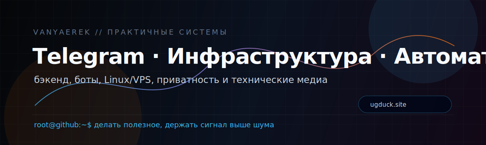

  

<h1 align="center">Vanya</h1>

  <b>Бэкенд · Telegram-инструменты · Linux/VPS-инфраструктура · AI-автоматизация · приватность</b>

  <a href="https://ugduck.site">Гадкий Утёнок</a> ·
  <a href="https://t.me/Gadkiy_utyonock">Telegram-канал</a>

---

## Обо мне

Я занимаюсь практичными техническими системами: от VPS и Linux-сервисов до бэкенда, Telegram-инструментов, баз данных, автоматизации и понятных пользовательских интерфейсов.

Мне интересны проекты, где важны надёжность, приватность, простая эксплуатация и ясная подача сложных технических тем.

---

## Что я знаю и умею

**Бэкенд и продуктовая логика**

- Go, Python, JavaScript
- Flask, FastAPI
- Telegram Bot API, aiogram
- SQLite, PostgreSQL
- REST API, фоновые задачи, скрипты автоматизации

**Инфраструктура**

- Linux и VPS-администрирование
- systemd, базовая контейнеризация, деплой
- Caddy, Nginx
- reverse proxy, TLS-сертификаты, логи, бэкапы

**Сети, приватность и VPN-инфраструктура**

- Xray, VLESS Reality, Hysteria2
- WireGuard, Remnawave-подход к инфраструктуре
- маршрутизация, подписки, клиентские конфиги, онбординг пользователей

**Безопасность и исследовательские задачи**

- OSINT
- приватность и цифровая гигиена
- Telegram/web security
- практичная модель угроз
- аккуратные операционные процессы

**AI и автоматизация**

- AI-assisted workflows
- агенты и автоматизация рутинных задач
- пайплайны для контента и исследований
- суммаризация, мониторинг, подготовка материалов

---

## Публичный проект

### Гадкий Утёнок

Независимый русскоязычный блог о технологиях, цифровой среде и кибербезопасности.

Проект про спокойную подачу, проверенные факты, приватность, кибербезопасность и понятный контекст без лишнего шума.

- Сайт: **https://ugduck.site**
- Telegram: **https://t.me/Gadkiy_utyonock**

---

## Текущий фокус

- делать полезные Telegram-native и web-инструменты;
- улучшать инфраструктуру, деплой и эксплуатацию сервисов;
- изучать приватность, безопасность и автоматизацию;
- развивать **«Гадкий Утёнок»** как понятное техническое медиа.

---

  <code>делать полезное · автоматизировать аккуратно · держать сигнал выше шума</code>

